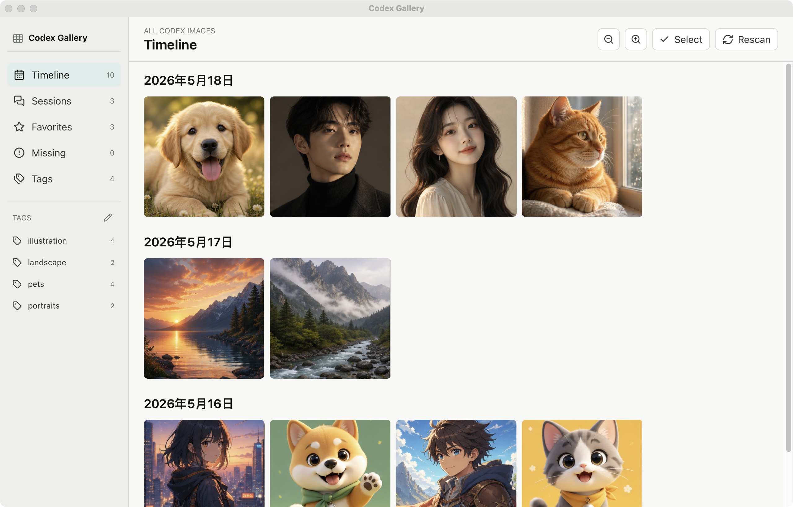

# Codex Gallery

Languages: English | [简体中文](./README.zh-CN.md) | [日本語](./README.ja.md)

Codex Gallery is a local-first desktop gallery for images generated by Codex. It scans your local Codex data directory, groups images by conversation, shows session titles when available, and lets you favorite, tag, compare, preview, inspect, and export images without modifying the original Codex files.

This is an unofficial companion app for Codex.

## Why

Codex-generated images are stored locally at:

```text
~/.codex/generated_images
```

However, Codex currently exposes generated images mainly inside the conversation where they were created. Once you generate images across many conversations, it becomes hard to:

- Browse all Codex-generated images in one place.
- Know which conversation an image came from.
- Find older images for follow-up creative work.
- Compare prompt variations side by side.
- Organize reusable images with your own tags.
- Export images for use on other platforms.

Codex Gallery turns those local images into a simple photo-library style experience.

## Features

- **Timeline**: browse all Codex-generated images by modified date.
- **Sessions**: group images by Codex conversation/thread id.
- **Session titles**: read conversation titles from Codex's local SQLite state when available.
- **Missing Session**: keep images visible even when the original session metadata is missing.
- **Favorites**: store favorites in Codex Gallery's own local SQLite database.
- **Tags**: add tags to images, browse tagged images from the sidebar, and rename or delete tags in a dedicated tag manager.
- **Adjustable thumbnails**: resize the gallery with toolbar buttons or smooth `Control` + mouse wheel zoom.
- **Multi-select**: select multiple images from the grid and export them as a batch.
- **Compare**: collect up to four images in the compare tray, then inspect them in grid, horizontal, vertical, or stacked split-view layouts.
- **Large preview**: open a centered large image preview with previous/next navigation.
- **Metadata**: inspect filename, dimensions, size, format, path, session id, project directory, and modified time.
- **Export**: copy individual or selected images to Downloads using their original filenames without moving the originals.
- **Auto refresh**: watch the Codex image directory and refresh when new images appear.
- **Lazy thumbnails**: scans return lightweight metadata; thumbnails are loaded on demand and cached locally.
- **Empty states**: show clear messages when Codex data, generated images, or session metadata are missing.

## Screenshots



This screenshot uses generated demo data only. It does not contain local Codex conversation titles, image files, or chat metadata.

## Data Sources

By default, Codex Gallery reads:

```text
~/.codex/generated_images
~/.codex/state_5.sqlite
```

Codex-generated images usually follow this structure:

```text
~/.codex/generated_images/{thread_id}/{image_file}
```

Codex Gallery treats `{thread_id}` as the image's session id and looks it up in:

```text
~/.codex/state_5.sqlite -> threads.id
```

Session titles use this fallback order:

1. `threads.title`
2. `threads.first_user_message`
3. Short session id

If an image folder exists but `state_5.sqlite` does not contain the corresponding thread, those images are grouped under **Missing Session**.

## Privacy And Safety

Codex Gallery is local-first.

- It does not upload images.
- It does not upload conversation metadata.
- It does not modify `~/.codex`.
- It opens Codex's `state_5.sqlite` in read-only mode.
- Favorites are stored in the app's own `codex-gallery.db`.
- Tags are stored in the app's own `codex-gallery.db`.
- Thumbnails are generated on demand and cached in the app data directory.
- Image read, export, and Finder reveal commands are restricted to `~/.codex/generated_images`.
- Export copies files to Downloads and does not move or delete originals.

## Requirements

- macOS-first for v1.
- Node.js and pnpm.
- Rust toolchain with `rustc` and `cargo` available on `PATH`.
- A local Codex data directory, especially `~/.codex/generated_images`.

Tauri can support Windows and Linux, but this project is currently developed and tested first on macOS.

## Getting Started

Clone the repository:

```sh
git clone https://github.com/Yidoon/codex-gallery.git
cd codex-gallery
```

Install dependencies:

```sh
pnpm install
```

Run the desktop app:

```sh
pnpm tauri:dev
```

You can also run the Vite shell:

```sh
pnpm dev
```

The plain browser page cannot scan local Codex files by itself. Use `pnpm tauri:dev` for the full desktop experience.

## Scripts

```sh
pnpm dev              # Start the Vite web shell
pnpm tauri:dev        # Start the Tauri desktop app
pnpm build            # Type-check and build the frontend
pnpm lint             # Run ESLint
pnpm release:check    # Verify release tag and app versions match
pnpm release:bump     # Bump package, Tauri, Cargo.toml, and Cargo.lock versions together
pnpm release:tag      # Create a release tag from the current app version
pnpm tauri:build      # Build the macOS .app bundle
pnpm tauri:build:dmg  # Build a DMG when the local packaging environment supports it
pnpm icons            # Regenerate app icons
```

Rust-side checks:

```sh
cd src-tauri
cargo test
cargo clippy --all-targets -- -D warnings
```

## Build Output

The default app-only build produces:

```text
src-tauri/target/release/bundle/macos/Codex Gallery.app
```

To build a DMG:

```sh
pnpm tauri:build:dmg
```

DMG packaging may depend on your local macOS packaging environment, code signing, and notarization setup.

## Release Workflow

GitHub Actions builds macOS DMG releases from version tags only. Pushes to `main` do not publish a release.

Use the release helper so `package.json`, `src-tauri/tauri.conf.json`, `src-tauri/Cargo.toml`, `src-tauri/Cargo.lock`, and the tag stay in sync:

```sh
pnpm release:bump -- patch
git add package.json src-tauri/tauri.conf.json src-tauri/Cargo.toml src-tauri/Cargo.lock
git commit -m "Release v1.0.1"
pnpm release:tag
git push origin main --follow-tags
```

Use `pnpm release:bump -- 1.0.1` for an explicit version. `pnpm release:tag` refuses to create a tag if the working tree is dirty or the tag already exists.

The workflow verifies the frontend and Rust backend, then uploads Apple Silicon and Intel macOS DMG assets to the GitHub Release. Current builds are not notarized yet, so macOS may show an unidentified developer warning.

## macOS Gatekeeper

Codex Gallery releases are currently unsigned and not notarized. After downloading the DMG, macOS may show a message such as `"Codex Gallery" is damaged and can't be opened`.

If that happens, move the app to Applications, then remove the quarantine attribute:

```sh
xattr -dr com.apple.quarantine "/Applications/Codex Gallery.app"
```

Then open Codex Gallery again from Applications.

## Project Structure

```text
.
├── src/                    # React + TypeScript frontend
│   ├── App.tsx             # Main UI state and view composition
│   ├── api.ts              # Tauri command wrappers
│   ├── components/         # Reusable UI components
│   └── types.ts            # Shared frontend data types
├── src-tauri/              # Rust/Tauri backend
│   ├── src/lib.rs          # Scanning, SQLite reads, watcher, exports, image commands
│   ├── capabilities/       # Tauri permission configuration
│   └── tauri.conf.json     # Tauri app configuration
├── scripts/                # Utility scripts, including release version helpers
├── docs/                   # README screenshots and documentation assets
└── public/                 # Static assets
```

## Data Model

Codex Gallery combines two local sources:

- Image files from `~/.codex/generated_images/{thread_id}`
- Session metadata from `~/.codex/state_5.sqlite`

Scans return lightweight image metadata. Thumbnails and full image data are loaded later through dedicated Tauri commands.

## Current Limitations

- v1 is macOS-first.
- The default Codex data directory is fixed to `~/.codex`.
- Export currently defaults to Downloads.
- Export currently keeps original filenames.
- Release builds are not signed or notarized yet.
- A project logo is still pending.

## Roadmap

- Configurable Codex data directory.
- Windows support.
- More flexible export naming templates.
- Configurable export destination.
- Thumbnail cache cleanup.
- Signed and notarized releases.
- More tests for scanning, Missing Session, tags, compare, and export behavior.

## Contributing

Issues and pull requests are welcome.

Before opening a pull request, please run:

```sh
pnpm lint
pnpm build
cd src-tauri
cargo test
cargo clippy --all-targets -- -D warnings
```

Contribution guidelines:

- Keep the app local-first.
- Do not write to `~/.codex`.
- Keep file access as narrow as possible.
- Keep the UI simple, restrained, and easy to understand.
- Add tests when changing scanning or export behavior.

## License

This project is licensed under the MIT License. See [LICENSE](./LICENSE).

## Disclaimer

Codex Gallery is not affiliated with, endorsed by, or maintained by OpenAI. It is an independent companion app for browsing locally generated Codex images.
